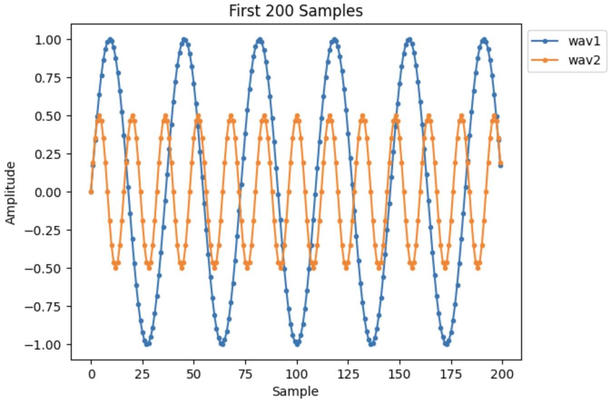
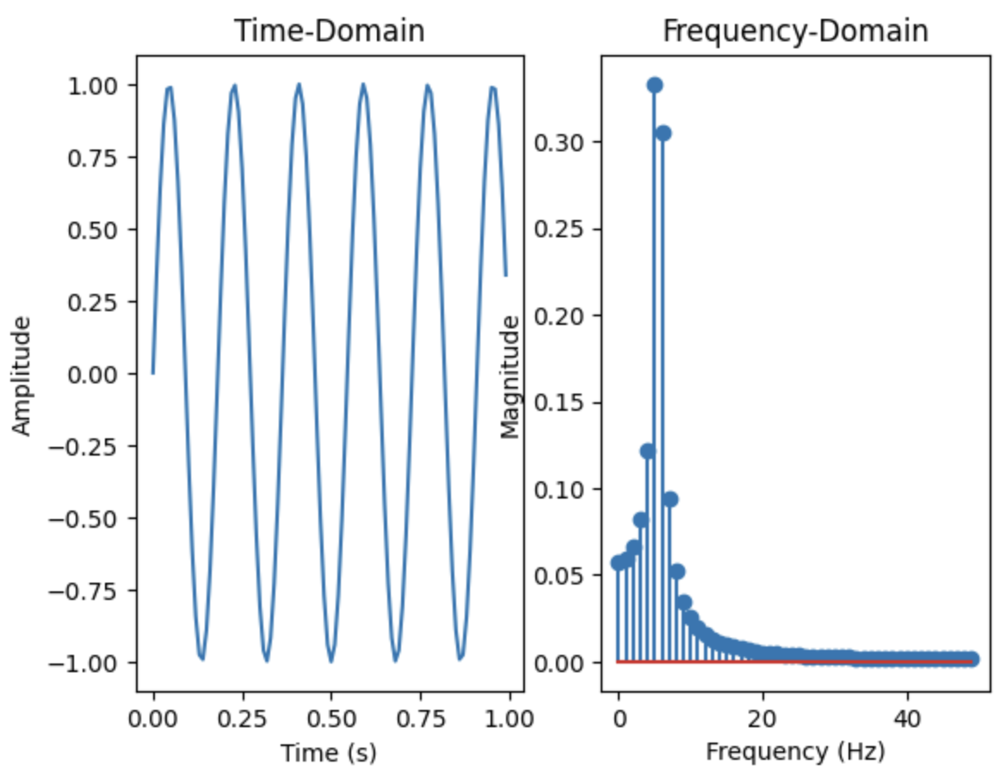
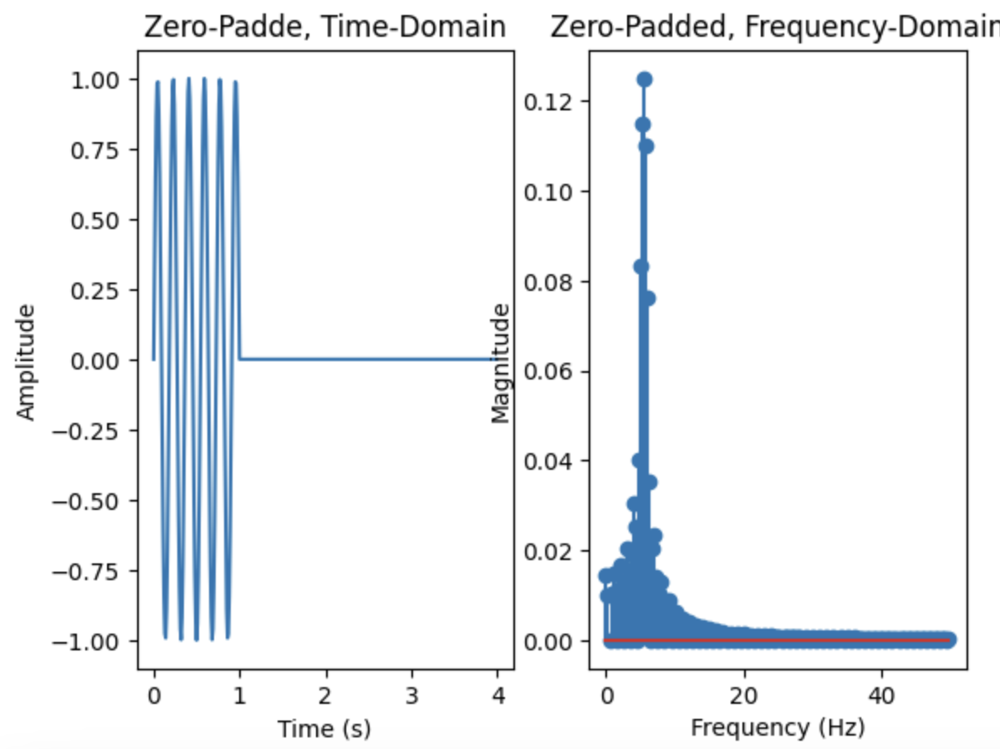
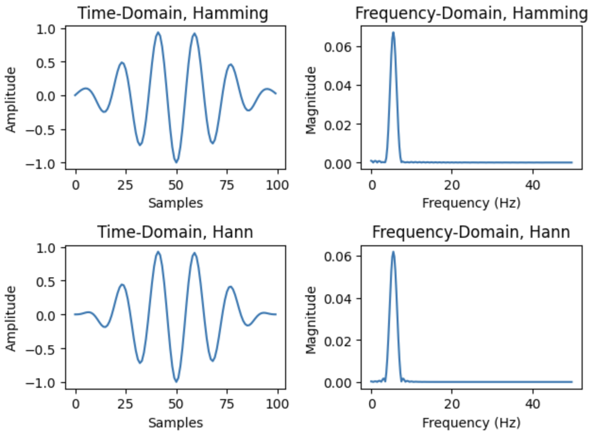
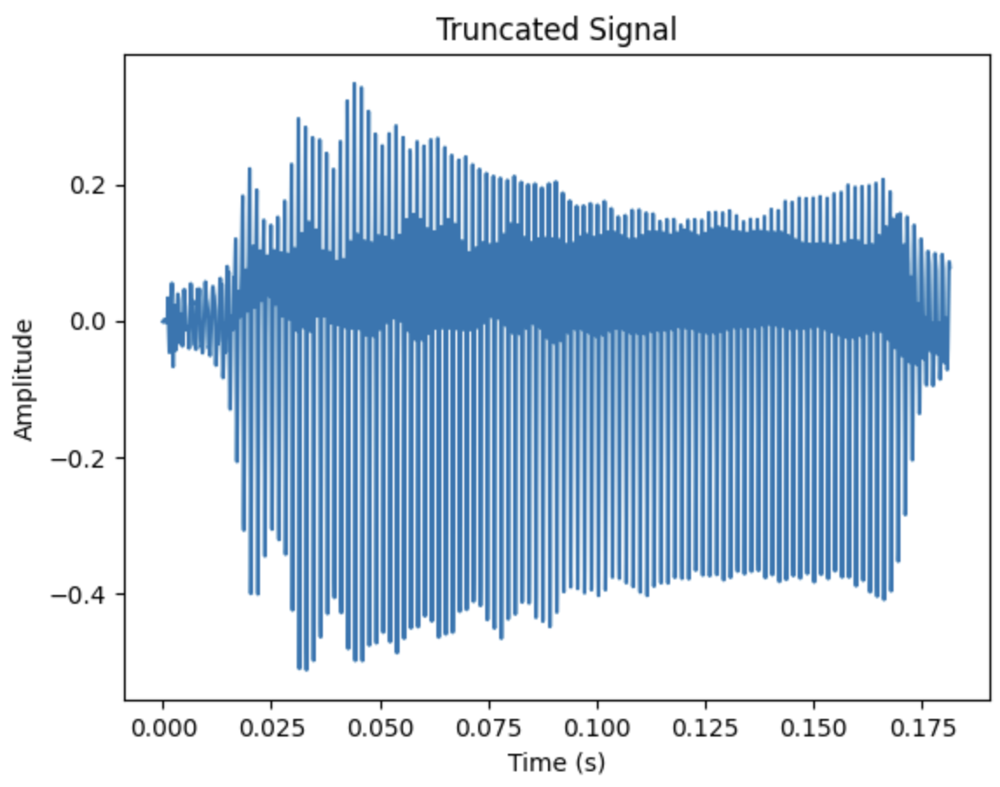
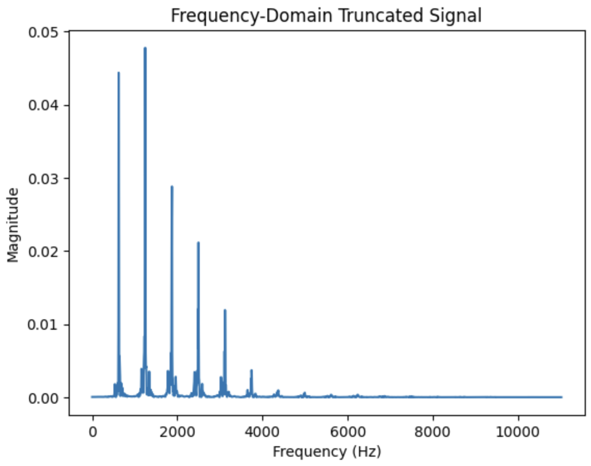
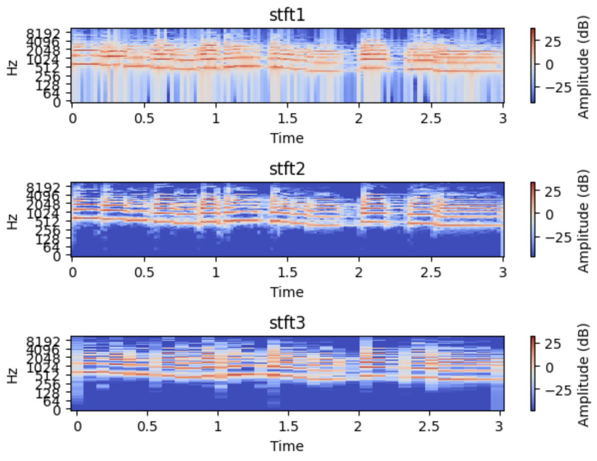

# 🎧 Audio Signal Processing Fundamentals

This project explores the foundations of audio signal processing by generating and analyzing simple waveforms both the time and frequency domains, and visualize their evolution over time using spectrograms.


## Waveform Synthesis

We begin by implementing a function `get_sinusoid()` that generates sine waves using the standard mathematical formula:

x(t) = A · sin(2πft + θ)


Parameters include amplitude, frequency, phase, sampling rate, and duration. 

**Example: Two waveforms with different frequency and amplitude**



---

## Discrete Fourier Transform (DFT) & Fast Fourier Transform (FFT)

Next we define a function `get_fft_spectrum()` to compute and clean up the frequency spectrum of a signal using NumPy’s `fft` implementation. The FFT output is truncated and normalized to obtain a meaningful magnitude spectrum for plotting.

**Time-domain and frequency-domain plots**




### Zero-Padding for Frequency Resolution

We add trailing zeros to the end of the signal to artificially increase its length. This doesn't add new frequency content, but it increases the number of frequency bins in the FFT result, allowing for higher visual resolution in the plotted spectrum.

```python
padded_signal = np.pad(signal, (0, 2048 - len(signal)), mode='constant')
freq_bins, padded_spectrum = get_fft_spectrum(padded_signal, sr)
```

**Zero-Padded Signal**



---

### Windowing to Reduce Spectral Leakage

We apply a Hann window to taper the edges of the signal before computing its FFT. By multiplying the signal by a smooth window before the FFT, we reduce abrupt discontinuities at the boundaries, leading to cleaner spectral estimates.

```python
window = np.hanning(len(signal))
windowed_signal = signal * window
freq_bins, windowed_spectrum = get_fft_spectrum(windowed_signal, sr)
```

**Windowed Signal**



---

### Applying FFT to Real Audio

Finally, we apply these techniques to real environmental audio loaded using `librosa`. We extract a short segment of the audio, apply a Hann window, and compute its FFT to examine the frequency content.

```python
y, sr = librosa.load("audio_clip.wav", sr=None)
segment = y[10000:12000]  # extract a slice of the waveform
windowed_segment = segment * np.hanning(len(segment))
freq_bins, spectrum = get_fft_spectrum(windowed_segment, sr)
```

<h4>Real Audio FFT</h4>
<p float="left">
  
  
</p>

---

## Short-Time Fourier Transform (STFT)

To analyze how frequency content changes over time, we apply the Short-Time Fourier Transform (STFT) using a custom implementation `simple_stft()` as well as `librosa.stft()`. STFT works by slicing the signal into overlapping windows and computing the FFT for each segment. This results in a 2D **time-frequency matrix**, where each row represents a frequency bin and each column represents a time frame.

We compare three STFT visualizations using different window types and hop lengths:

```python
stft1 = simple_stft(y_truncated, frame_len=1024, hop_len=512, window_type='boxcar')
stft2 = simple_stft(y_truncated, frame_len=1024, hop_len=512, window_type='hann')
stft3 = simple_stft(y_truncated, frame_len=1024, hop_len=2056, window_type='hann')
```

**STFT Visualizations:**



---

### Observations:

- **STFT1 (Boxcar window, hop=512):**  
  The boxcar (rectangular) window causes **spectral leakage**, making the frequency components blurrier. While the moderate hop length offers decent time resolution, the frequency detail suffers due to the sharp edges of the window.

- **STFT2 (Hann window, hop=512):**  
  The Hann window reduces spectral leakage, resulting in **cleaner harmonic structures**. Using the same hop length as STFT1, this setting improves frequency clarity without sacrificing time resolution.

- **STFT3 (Hann window, hop=2056):**  
  A **larger hop length** decreases time resolution (fewer frames), but improves frequency resolution. Harmonic bands appear more distinct, but fine-grained temporal events may be lost.

---
